# Project 5 - The Advice Found

[Advice Found live demo](https://advisor-finder.herokuapp.com/)\
[Advice Found repository](https://github.com/jannis-kiriasis/advisor-finder)

## Table of contents
-  [Introduction](#introduction)
-  [E-commerce business model](#business-model)
-   [User Experience (UX)](#user-experience-(UX)-–-the-needs)
-	[Features](#features)
-	[Where user stories meet features](#where-user-stories-meet-features)
-	[Wireframes](#wireframes)
-  [Features left to implement](#features-left-to-implement)
-	[Designs](#design)
-  [Accessibility](#accessibility)
-  [SEO](#seo)
-  [Planning](#planning)
-  [Data model](#data-model)
-	[Technologies and tools used](#technologies-and-tools-used)
-	[Testing](#testing)
-	[Issues fixed](#issues-fixed)
-	[Known bugs](#known-bugs)
-	[Deployment](#deployment)
-  [Acknowledgements](#acknowledgements)

## Introduction

Advice Found is a platform that matches financial advisors to financial advice seekers. 

Financial advice seekers can find financial advisors and meet them online through the platform.

Many people don't even know who financial advisors are and what they do.

Somebody may think they are for wealthy people.

The reality is that a financial advisor can help us decide whether we should start a private pension or an investment plan.

Whether we need a savings fund or income protection.

Those who know they need a financial advisor may struggle to find a good one.

Advice Found is for both those categories. 

If you know you need financial advice, use Advice Found to find the best solution for you.

If you don't know you need one, our resources may help you figure it out.

Let me tell you, you'll need financial advice at some point in your life. 

If you are not part of the thousands of people looking for financial advice in Ireland, you will, soon.

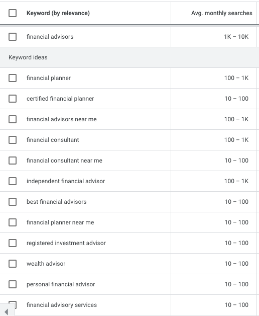

This is what you can do with Advice Found:
1. Register as an advice seeker / financial advisor.
2. Match a financial advisor that suits you / find new clients.
3. Buy a consultation with an advisor / generate more income.

### Who is Advice Found for?
Advice Found is for advice seekers and financial advisors.

### What Advice Found offer:
- A simple registration form for Advice Seekers and Financial Advisors
- An algorithm that matches the advice seeker's need with the financial advisor's specialisation
- A chat to connect the two parties
- A consultation scheduling system
- A checkout system
- An online consultation platform
- A dashboard for financial advisors to see all of their clients and consultations scheduled

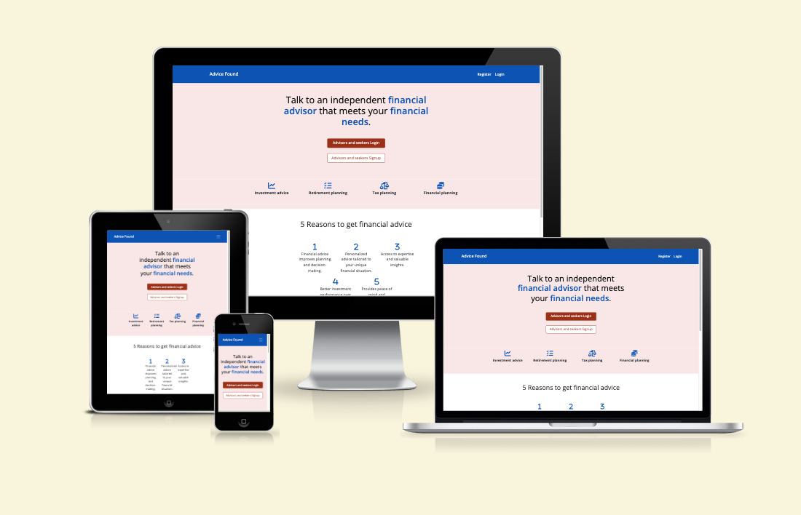  

## Business model

Advice Found is where financial advisers and financial advice seekers meet. It offers a platform to meet and communicate.

It is an opportunity for advisors to find new clients online without having to worry about managing payment 
and marketing their business. That is what Advice Found do.

It is also an opportunity for seekers to be matched with an advisor that knows what do to.
Every situation is different and many seekers don't know where to start when looking for financial advice.
It's their money we are talking about so they want to be careful. From here the idea of a 'best match'.

## Where does Advice Found revenue come from?

At the moment Advice Found adds a 5% fee on the transactions. So every time a consultation is confirmed,
Advice Found makes 5% of it. The fee is on the seekers. To grow the revenue it is also possible to apply a fee to the advisors.

The idea is that seekers and advisors can build long lasting relationships on the platform. The risk is that once the 2 parties get to know each other, they make the conversation off the platform. For this reason, it's important to keep the payments on the platform and keep building features and tools that advisors and seekers would use to manage their finances. The likes of tax calculators, budget calculators, savings and investment growth calculators, financial health checks etc.

The more tools we can build to keep the engagement on the platform and the more seekers and advisors will come back to use it.

To onboard brokers, there will be a mix of offline and online channels. 

To onboard seekers, digital channels will be the favourites with a mix of organic and paid search and social media.

On the website, there is a newsletter signup. The heading is a hook to get users to sign up. "A guide to the best financial returns" sounds like an attractive piece if you are looking to save on taxes, invest your money or plan for retirement. Once an email list is created, it can be used to promote material for the same audience. The audience can be segmented based on how they behave on the emails (they read it or not, open or not etc). So then the emailing strategy will differ for every segment. For example, if with the segmentation we figure out there is an audience interested in tax planning, we'll send them information about tax deadlines, tax credits available etc.

A [Facebook page](/media/README-files/af-facebook-page.png) has also been created. Since it doesn't focus on a specific area such as retirements or investments or taxes only, but it is a business page, we can talk about personal finance here. Personal finance is pretty generic so we can use it to give people tips on savings, tracking investments, budgeting etc.

More on SEO and marketing in the following paragraphs.

## User Experience (UX) – The needs
Now that we are familiar with Advice Found target audience and offering, we are looking at the needs the app users may have. 

I have identified 3 main stakeholders (you guessed them by now):

### The advice seeker (AS)
The advice seeker is looking for a financial advisor and doesn't know how to choose one or where to find one.

The advice seeker wants a financial advisor close to their location that can best solve their issue.

The advice seeker wants to be guided through the choice. The market is full of advisors, it is often not clear 
what advisors do and how they can help.

### The financial advisor (FA)

The financial advisor wants to find new leads. An online platform can extend its reach to the entire country. They will
not be limited to local clients as it is more common for brick-and-mortar businesses.

The financial advisor needs to be able to talk to their clients remotely and keep track of all the appointments.

### Advice Found (AF)

The company needs to make sure that the advisors are legit businesses.

They also need to guarantee an afflux of possible clients to the platform so that advisors will also join.

## Epics and User Stories

Following, you can find the epics and the user stories breakdown used to plan the development of the app.

### Epic 1 - The profiles: The Advisers and the Seekers need to be able to create profiles that they can cancel and update.

#### USER STORY 1: Advisor profile creation

As a financial adviser,
I want to register to the platform by creating my advisor profile,
so that I can market my specialisations to potential clients.

**Acceptance criteria:**
- The adviser's required information is a business name, business address, business description, location, postcode, specialisations, and registration number.
- Implement real-time feedback on the action taken

**Subtasks:**
1. Create model AdviserUserProfile
2. Create model Specialisation
3. Create model Location
4. Create basic HTML navigation with sign-in / out, create adviser profile
5. Create add adviser profile form (template, view and URLs)
6. Add on-page notification of profile created
7. Add defensive design: Are you sure you want to submit your profile for approval?
8. Create an adviser profile page (template, view and URLs)

#### USER STORY 2: Advisor edit profile

As a financial adviser,
I want to edit and deactivate my profile
so that if I want to make changes to my profile or be hidden for a while, I can do so.

**Acceptance criteria:**
- All the Adviser information can be edited
- Use defensive design to avoid mistakes
- Implement real-time feedback on the action taken
- The adviser can pause their account not to get other clients and not be shown

**Subtasks:**
1. Create an edit button in the Adviser profile template with views and URLs
2. Create an edit adviser form template with views and URLs
3. Add on-page notification of profile updated request sent
4. Add defensive design: Are you sure you want to submit your profile update request for approval?
5. Add a button to make advisor active /inactive
6. Add active/inactive defensive design

Dependency US 1

#### USER STORY 3: Admin registration approval

As an admin,
I want to approve the adviser registration request and edit requests so that I can validate the quality and legitimacy of the information declared.

**Acceptance criteria:**
- Admin needs to approve new profiles and edit requests before the updates are published
- Approved or not approved status needs to be reflected on the adviser profile page

**Subtasks:**
1. Create admin panel
2. Create approve new profile button in the admin panel
4. Add pending approval status in the Adviser profile page (template and views)
5. Add visual feedback in the Adviser template when the profile is approved
6. Add visual feedback in the Adviser template when the profile is not approved
7. Add visual feedback in the Adviser template when the edit request is approved
8. Add visual feedback in the Adviser template when the edit request is not approved

#### USER STORY 4: Seeker profile creation

As an Advice Seeker,
I want to register for the app and find the best financial advisor so
I can find an advisor.

**Acceptance criteria:**
- Give a Seeker the ability to register 
- The Seeker required information are: postcode, city, address, need
- The Seeker must log in to create a profile
- Implement real-time feedback on the action taken
- Log-in details and user profile are created simultaneously

**Subtasks:**
1. Create model SeekerUserProfile
2. Create add seeker profile form (template, view and URLs)
3. Add on-page notification of profile created
4. Create a Seeker profile page (template, view and URLs)

#### USER STORY 5: Seeker profile edit and cancel 

As a Seeker,
I want to edit and cancel my profile so that
if I don't want to use the app anymore or need to make some changes, I can do so.

**Acceptance criteria:**
- All the Seeker information can be edited
- The profile can be cancelled
- Use defensive design to avoid mistakes
- Implement real-time feedback on the action taken

**Subtasks:**
1. Create an edit button in the Seeker profile template with views and URLs
2. Create an edit seeker form template with views and URLs
3. Add on-page notification of profile updated request sent
4. Add defensive design: Are you sure you want to submit your profile update request for approval?
5. Create a delete button in the Seeker profile template with views and URLs
6. Add on-page notification of profile deleted
7. Add defensive design: Are you sure you want to delete your profile 

Dependency US 1, US 4

### Epic 2 - The Matcher: The matcher connects Seekers and Advisers and shows the best match and the other results based on the algorithm criteria (specified in user stories).

#### USER STORY 6: Matching logic

As an advice seeker,
I want to be matched with a financial advisor
that best suits my need.

**Acceptance criteria:** 
- One main option must be given to the Seeker
- The Seeker can still see other possible good options
- Add other relevant advisors after the best match
- Notify the advisor when there is a new match

**Subtasks:**
1. Create a few Adviser profiles
2. Create a few Seekers profiles
3. Create a Match template (HTML + CSS)
4. Create a view to filter Advisers by the Seeker’s location, need
5. Create URLs
6. Create a query set to add to the template other possible advisors

#### USER STORY 7: Clients view

As an Adviser,
I want to see all the Seekers I matched and the seekers who are already clients so that
I can follow up on conversations easily.

**Acceptance criteria:** 
- See a list of the clients and their profile information
- See the individual conversations with the Seekers

**Subtasks:**
1. Create clients template
2. Create views
3. Create URLs
4. Create a seeker profile (template view and URL)

### Epic 3 - The chat: Creation of the app that will facilitate the Seeker and the Adviser conversations

#### USER STORY 8: The chat - Seeker

As an advice seeker,
I want to message the advisor I matched with so that
we can schedule a consultation.

**Acceptance criteria:** 
- On the advisor’s page, the seeker must be able to message the advisor
- I want to be notified when I have a message to read

**Subtasks:**
1. Create a chat template on the seeker’s advisor page
2. Create chat view and URL
3. Create message template
4. Create message form
5. Create model message
6. Email advisor when there is a new message

#### USER STORY 9: The chat - Advisor

As an advisor,
I want to message the seeker I am matched with so that
we can schedule a consultation.

**Acceptance criteria:**
- On the client's page, the advisor can see the client’s profile whit the chat
- On the client profile, there is a message form to message the client
- On the client profile, the advisor can see the client’s details and chat
- The client must be notified when there is a message to read

**Subtasks:**
1. Create a button to open the chat or client page
2. Create a client profile template page
3. Create client profile view and URL
4. Create conversation logic on the client profile page
5. Send an email to the client when the advisor adds a message

#### USER STORY 10: Advisor view

As an Advice seeker,
I want to see all the information of the advisor I matched with and our conversation so that
I can find our information easily.

**Acceptance criteria:** 
- On the advisor page, I have to find his business info and the chat to contact them easily

**Subtasks:**
1. Create advisor template
2. Create views
3. Create URLs

### Epic 4 - The order: Creation of the checkout and payment processes.

#### USER STORY 11: Schedule consultation

As a financial advisor,
I want to schedule a consultation,
so that I can meet the Seeker.

**Acceptance criteria:**
- The advisor can send an appointment with a link to a video chat
- The advisor received an on-screen notification on consultation sent
- The appointment appears in the chat
- The Seeker receives an email with the appointment details and a link to pay
- The Seeker receives the appointment by a chat with a button to confirm
- When the first consultation is scheduled, the adviser becomes the Seeker’s adviser and it will be visible in the seeker's profile

**Subtasks:**
1. Create consultation form
2. Create consultation message view and template
3. Create a message output template
4. Create consultation model
5. The seeker receives an email with consultation details
6. Seeker sees the appointment in the chat with the advisor

### USER STORY 12: Appointments

As an advisor,
I want to see all the appointments I have scheduled
so that I can keep up with every client.

**Acceptance Criteria:**
- Appointments need to be ordered by the closest one
- Appointments need to be labelled confirmed or not confirmed

**Subtasks:**
1. Create template and URLs for the appointment page
2. Create appointment View
3. Create a view to mark the appointment confirmed after payment 
(completed in a later sprint)	
4. Change consultation status
5. Disable cancel button
6. Seeker sees the link to the meeting instead of confirming the consultation

### USER STORY 13: The checkout

As a seeker,
I want to pay for the consultation
so that I can talk to an Adviser.

**Acceptance Criteria**
- The Seeker needs to go through the checkout and pay for the consultation
- The Adviser receives an email with the payment confirmed
- The Seeker receives an email with the confirmation
- The link to start the meeting with the advisor becomes available

**Subtasks:**
1. Order model
2. Create checkout form
3. Create checkout views 
4. Create checkout template
5. Connect stripe (create webhooks)
6. Send payment intent to stripe
7. Add on-page notification of order processed
8. Send an email to the seeker with the consultation schedule and payment link
9. Remove the button on checkout to pay after the consultation has been paid (or redirect to another page)

### USER STORY 14: Notify advisor of consultation confirmed

As an adviser, 
I want to be notified about the payment success and the consultation confirmation
so that I can get ready for the meeting.

**Acceptance Criteria**
- Send an email to the Adviser with the payment confirmation and the link to access the chat.

**Subtasks:**
1. Create send the email logic
2. Create the email template

Mapping out the user stories helped me easily identify the problems the application solves:

- This app helps seekers who are not sure where to find financial advice
- Advisors are selected based on the seeker's need and close to their location
- Advisors can find new clients easily that they can help as they specialise in the seekers' need
- Advisors can find clients nationwide
- Advisors don't need to handle online payments or install any technology
- Payments are happening securely online

## Features

In the following paragraphs, we are going to see what features appear on the website and where they meet the users' needs.

### 1. Main navigation

The main navigation is different for logged-in users and logged-out users.

Logged-out users can only see the links to log in and register to the app.

Navigation is also different for users that have completed the signup process and users that haven't completed the sign-up process.

Users that haven't completed the signup process can only see a logout link.

Users that have completed the signup process see different navigation menus whether they are seekers or advisors.

Advisors see the following links:

  

They are self-explanatory.

Seekers see the following links:

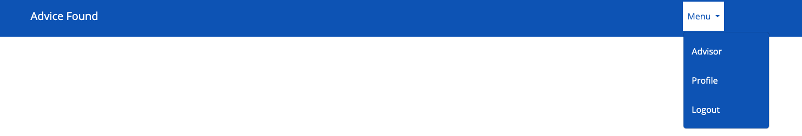  

### 2. The signup - User creation

The first part of the signup process requires the user to create an account with their personal information.

  

### 2. The signup - User choice

The second part of the signup process requires users to select whether they are seekers or advisors.

[Signup 2](./media/README-files/signup-two.png)  

### 2. The signup - Seeker or advisor profile creation

The third step of the signup process requires users to complete the seeker or advisor forms with information specific to each user type.

**Advisor form**
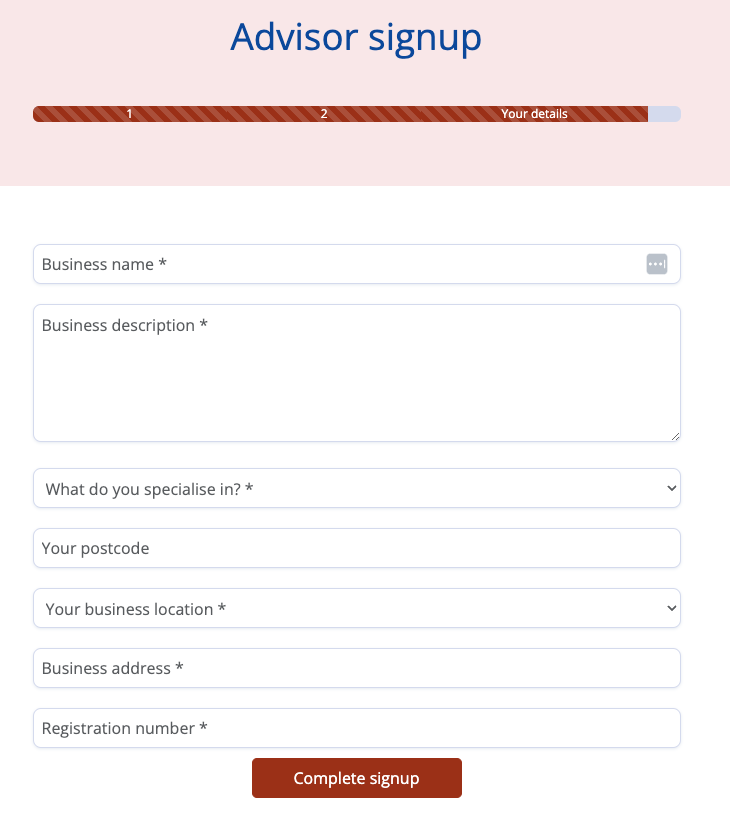  

**Seeker form**
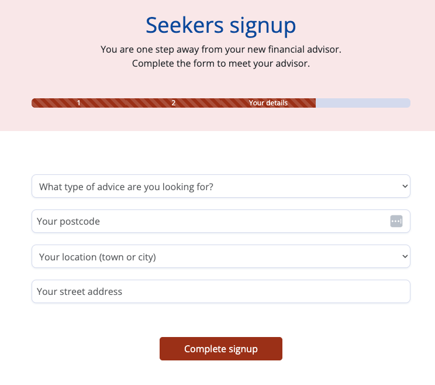  

### 3. The matching page

On the matching page, seekers are presented with their best matches. Should they decide to match with another advisor, they have the option to do it.

The seeker is matched with an advisor based on the following criteria:
1. seeker's need is equal to the advisor's specialisation
2. seeker's location is equal to the advisor's location
3. a randomiser selects 1 advisor out of the restricted pool to make sure it isn't always the same advisor

In case there isn't an advisor in the same city, the match is based on the need and the randomiser.
There should always be an advisor for every specialisation, however in case it is also missing, the advisor selection is randomised.

Below the best match, is the remaining list of advisors available in random order in case the seeker wants to choose a different advisor.

To be included in the matching logic, the advisor must:
1. have been approved (by Advice Found)
2. not be inactive (advisors can deactivate their profile if they don't want to be matched)

Currently, the seekers can't be rematched. This feature can be added in the future. Anyway generally, this is a long-lasting relationship.

### 4. The seeker profile

On this page, the seeker can review their profile details and update them if needed.

They can also cancel their profiles.

A defensive design popup will ask to confirm both actions.

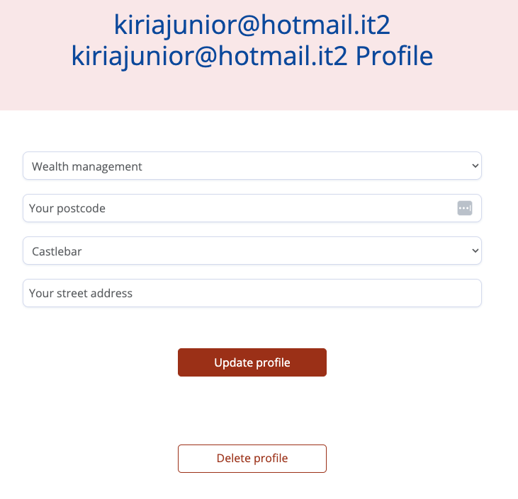  

### 5. The seeker's advisor

On this page, the seekers can see the main information about their advisors and can send a message.

Here is where the seekers will receive the messages and the consultation proposals.

On this same page, on the consultation proposals, the seeker can accept the consultation and go through the checkout.

Only after the checkout is completed, the seeker receives the video conference link to meet the advisor on the date agreed.

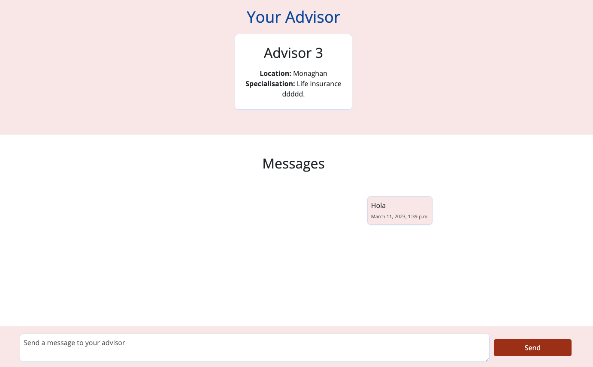  

### 6. The checkout

On the checkout page, the seekers can review their fees and their personal details and pay.

The checkout page doesn't appear if there are no consultations to checkout.

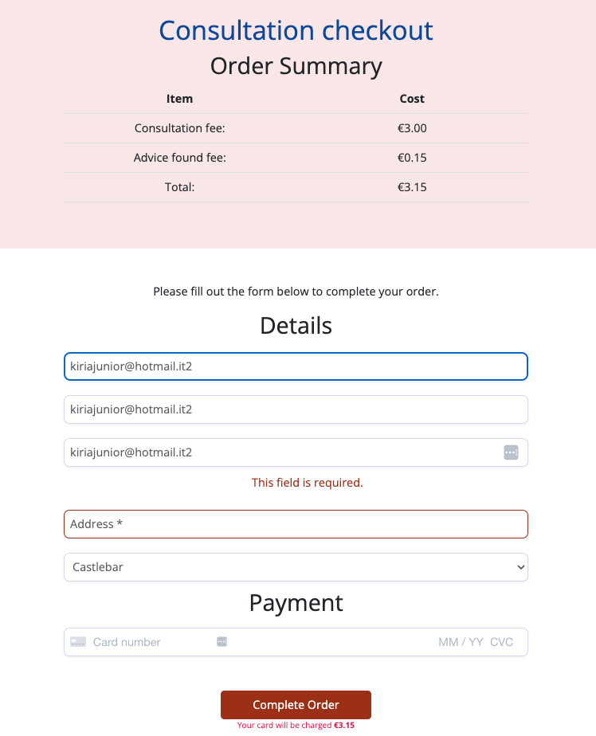

### 7. The checkout success

After the checkout is completed, the user sees a checkout completed page with a recap of their order.

They receive an email with the details of the consultation.

They can now see the meeting link also on their advisor's consultation proposal.

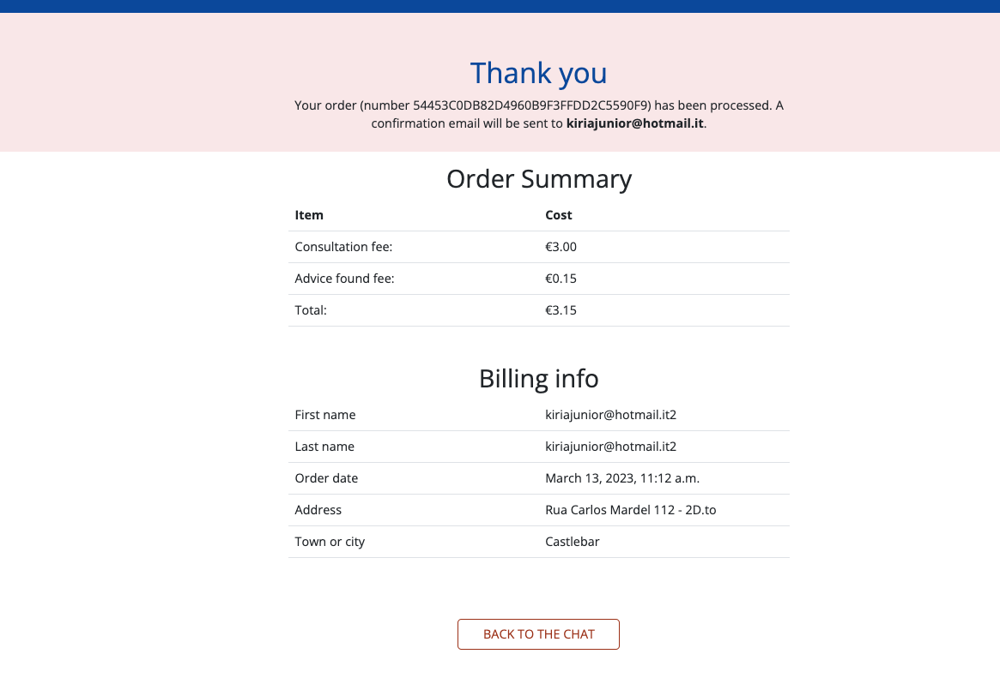

### 8. The advisor profile page

The advisor can review their personal details on their profile page.

For security reasons, if the advisor needs to make a change to their profile, the amendments need to be approved by Advice Found.

This is to make sure that the advisor is a real business and registered.

From this page, the advisor can deactivate their profile. Deactivating the profile means that the advisor will not receive new clients.

The advisor can't cancel their profile as the seekers will need to be re-matched. This feature could be developed in a future sprint.

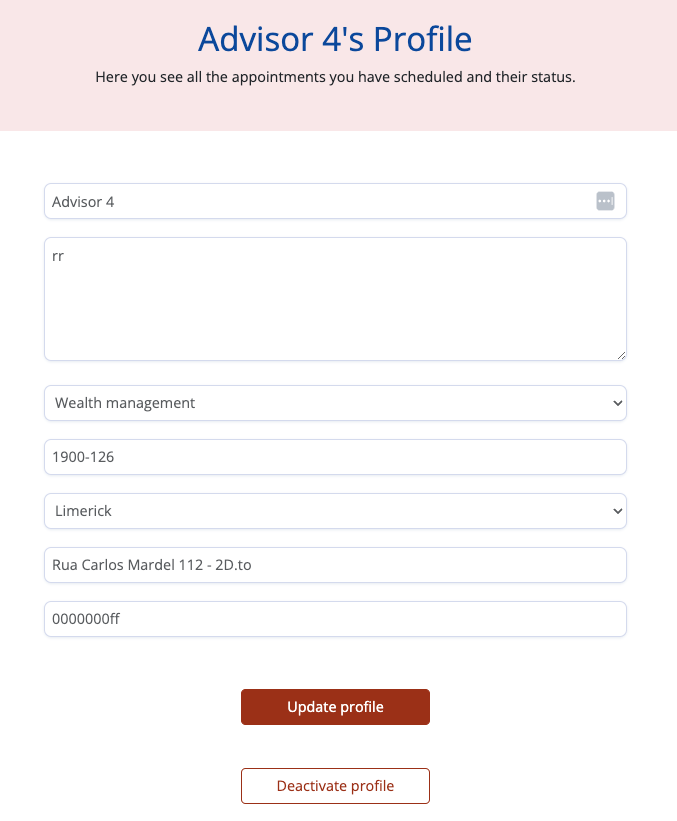

### 9. The advisor's appointments page

On this page, the advisors can see all the appointment they have scheduled and their status. An appointment must be paid for by the seeker before it's confirmed.

From this page, the advisor can also navigate to the seeker's profile pages.

### 10. The advisors' client profiles

On their client's personal pages, the advisor can see all the main details about a client as well as schedule a meeting and send a normal message.

The advisor can schedule only 1 meeting at a time. If there is a consultation pending confirmation, the option to schedule another meeting is disabled.

On this page, the advisor also sees the full conversation with the client.

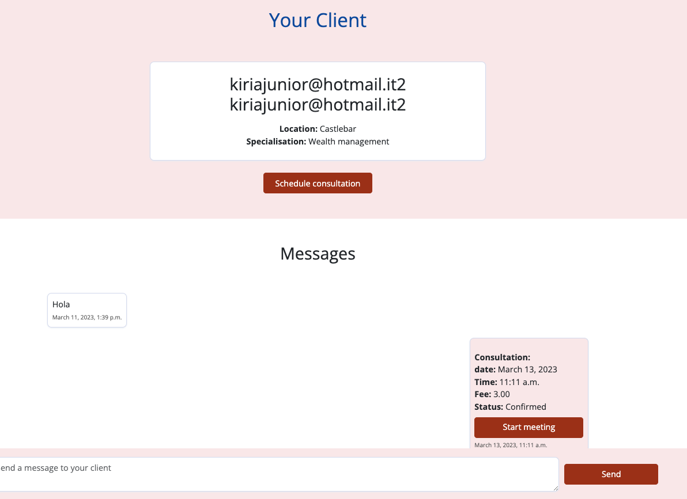

### 11. The consultation scheduler
With the meeting scheduler, the advisor can schedule a meeting with the seeker.

The fields required are date (can't be a past date), time and consultation fee.

The meeting link is automatically generated with a third-party tool https://gotalk.to/. it's free to use and doesn't require an account.

The seeker receives the meeting link after the payment is completed.

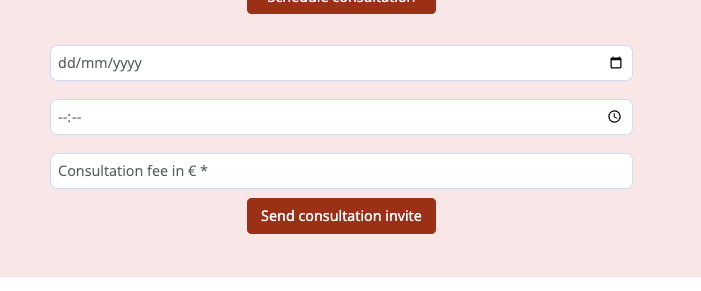

### 12. The clients' page

On the clients' page, the advisor sees a list of all of their clients, and a link to go to their personal profiles.

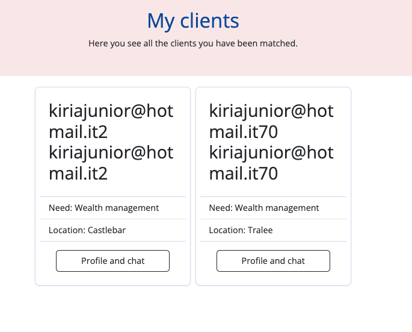

### 13. Login

A form to authenticate the user to the app. A non-authenticated user who tries to navigate the site will always be redirected to the sign-in page.

Page feedback has been implemented when a user logs in and signs up.

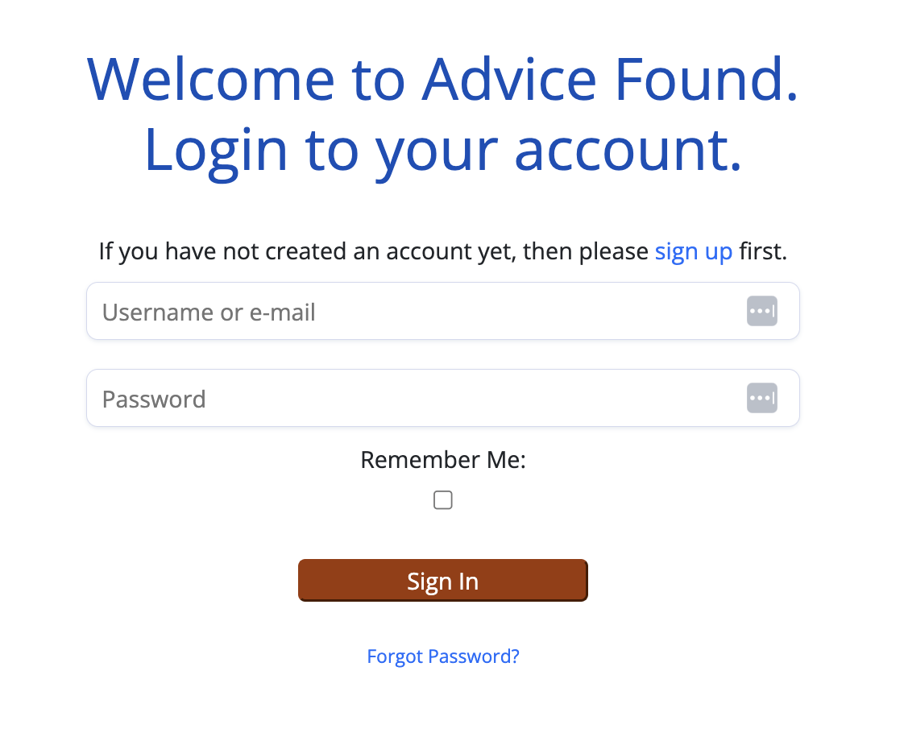  

### 14. Feedbacks and popups

The application let the users know every time they interact with it whether the action has been completed or not.

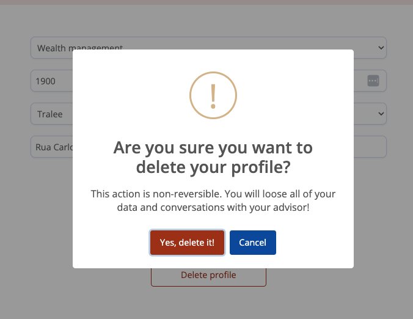  

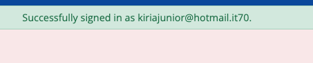  

### 15. 404 and 500 error pages

The 404 and 500 error pages handle errors nicely explaining to the user what is happening and offering a way to exit the error.

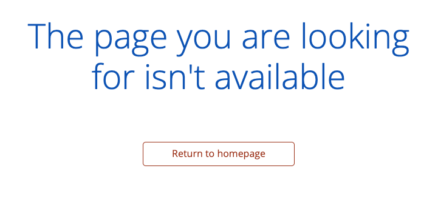  

### 16. Admin advisor approval

The admin can approve an advisor from the admin panel

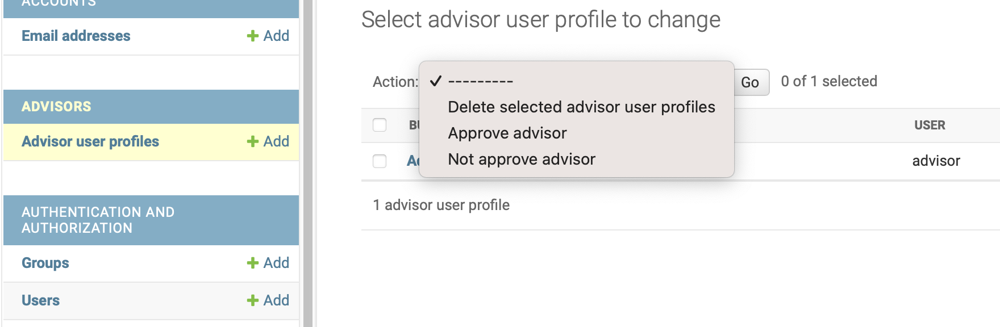  

## Where user stories meet features

In the following table, I’m going to match features with user stories and the issues the app solves. All the user stories, features and needs outlined in the paragraphs above have a number that corresponds to the number you see in the table below.

|                    User stories                    | Features  |
|:--------------------------------------------------:|-----------|
|          E1 US1 - Advisor profile creation         | 2         |
|            E1 US2 – Advisor edit profile           | 8         |
|        E1 US3 – Admin registration approval        | 16        |
|          E1 US4 – Seeker profile creation          | 2, 14     |
|       E1 US5 – Seeker profile edit and cancel      | 4, 14     |
|               E2 US6 – Matching logic              | 3, 14     |
|                E2 US7 - Clients view               | 1, 12     |
|             E3 US8 - The chat - Seeker             | 1, 14     |
|             E3 US9 - The chat - Advisor            | 1, 10, 14 |
|               E3 US10 - Advisor view               | 1, 7      |
|           E3 US11 - Schedule consultations         | 1, 11     |
|               E3 US12 - Appointments               | 1, 8, 14  |
|               E3 US13 - The checkout               | 6         |
| E3 US14 - Notify advisor of consultation confirmed | 14        |

## Wireframes

The first draft of the website was completed by creating wireframes using Balsamic.

Below you can find a link to the initial wireframes created. The main goal when I created the wireframes was to fulfil the user story requirements. Later on, during the development, I upgraded the styling getting to the final version that you see live.

[Wireframe](./media/README-files/wireframes.pdf)  

## Features to be implemented

- Let advisors cancel their profiles and handle advisor's clients
- Let seekers find a different advisor
- Create an admin dashboard to see Advice Found revenue
- Build a report to see the most active advisors and those scheduling more meetings

## Design

In the following paragraph, I'm going to explain the colours, typography and imagery choices.

### Colours

I've used a similar colour palette to projects I previously realised (pp2 and pp4) so the reasoning behind the colour choice is very similar.

The main colour used is a shade of blue (cobalt). Blue is a calm and serene colour. It is often associated with stability and reliability. I've increased a bit the contrast ratio with light backgrounds to achieve accessibility best scores.

All the main buttons are brown. It's different enough to differentiate from the main cobalt colour. The secondary buttons are white with brown borders.

A lighter shade of brown was used to highlight the best match, the seeker's advisor and the advisor's clients' profiles. It was also used to colour the background of the messages sent.

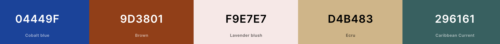

All the text colour combinations have been tested for accessibility and they all achieve WCAG AAA.
- [Colour contrast test: cobalt on white](https://webaim.org/resources/contrastchecker/?fcolor=054FB9&bcolor=FFFFFF)   
- [Colour contrast test: cobalt on lavender blush](https://webaim.org/resources/contrastchecker/?fcolor=04449F&bcolor=F9E7E7)   
- [Colour contrast test: brown on white](https://webaim.org/resources/contrastchecker/?fcolor=9D3801&bcolor=FFFFFF)   

Tested with [Contrast checker](https://webaim.org/resources/contrastchecker/).

The Lighthouse reports also show no accessibility issues (100%). More on Lighthouse below.

### Typography

The typography was chosen for my liking, again I've used it in previous projects PP2. Open Sans is a very popular font if not the most popular.

I used [Open Sans](https://fonts.google.com/specimen/Open+Sans) for all body elements.  

The fallback font used is Helvetica for all body elements.

### Imagery

The only image used in this project is the favicon. I've used a few icons on the homepage from Fontawesome.

## Accessibility

As mentioned above, all the colour combinations used for text passed a contrast ratio test.

I've also used aria labels to describe links.  
The pages have been structured using semantic HTML markup.  

## SEO

This app has been created for advice seekers to find independent financial advice. The main action and offering of the homepage are to give users a way to get financial advice.

Therefore, the search intent I'm going after is those of users looking for financial advice.

With a quick brainstorming, I thought that users looking for financial advice on Google would look for:
- Find a financial advisor
- find a financial advisor in Ireland
- financial advice
- financial advisor finder
- financial planners
- financial advisors
- dipendent financial advisors
- Independent financial advisors in Ireland

Then I validated my ideas with Google Ads keywords planner.

From here the question is: what do people looking for financial advisors want to know? I need to answer this question to make the content EEAT-compliant. By looking at the SERP results seems like the majority of results are actual advisors. 
So looking at what content they have on their page, the most common topics are:

- what benefits seekers can get from them
- the services/products they cover
- testimonials/client stories

So this is what I'm going to include on the homepage. In the real world, I would include also:
number of clients and advisors using the platform (social proof)
review widgets, the like of Trustpilot (social proof + I can add schema markup on the page)

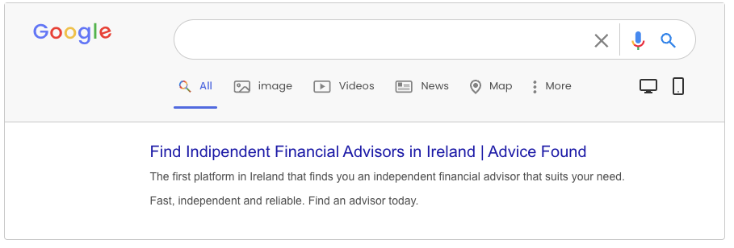  

The only 3 public pages of my site are:

- The homepage
- signup
- login

On all the 3 pages I've set the:

- Open graph tags ( to render the image and title nicely when the page is shared on social media)
- meta description
- meta robots
- canonical link
- title tag

Those are not necessary for all of the other pages since they are behind a login wall and search engine crawlers can't crawl (and so index) them.
I also made sure that:

- There aren't broken internal links
- For all external links, I don't want to pass link authority to, have a 'rel' no follow attribute (there is no sponsored content or paid content on my site)
- 404 errors and server errors are handled nicely
- accessibility score is 100% (more on the Lighthouse report below)
- The SEO score on Lighthouse is 100%
- Core web vitals are good (more on the Lighthouse report below)
- All the links have an aria-label or aria-labelledby attribute
- Semantic HTML has been used throughout the app (nav, header, section, footer. etc.)

## Planning

To build this app I've used [Jira](https://kiria.atlassian.net/jira/software/c/projects/AF/boards/3/backlog?atlOrigin=eyJpIjoiYzI4YTU2NjJkY2IyNDBkZGJkNWM5Nzg5MGNkNWI5ODciLCJwIjoiaiJ9) (Access was given to the CI assessment team) as an agile tool. 

The development took 5 sprints of different lengths in terms of days but with similar total story points (around 27-29 per sprint).

The tasks in each sprint were prioritised using the Moscow method and the priority settings in the task details as well as using labels. With the Moscow method, user stories and tasks are categorised into: Must do, Should do, Could do, and Won't do.

In every sprint, about 60% of the user stories had a priority level of Must do or Should do. The remaining 40% was Could do or Won't do. Many of the tasks and user stories that were marked as won't do in a sprint, were marked as should do or must do in the following sprint.

You have probably seen the epics and user stories a few paragraphs above. They are also available on the Jira board.

## Data model  
For this app, I've created 10 data models and inherited others from Django Allauth.

In this , I'm going to focus on the data models I've created and the most important inherited ones.

For more details on all the fields and models available and their relations, you can view this [database schema](/media/README-files/data-model-advice-found.png).

**Location**
Contains an Irish city or town.
- city 

**Specialisation**
Contains an area of specialisation of the financial advisors or need of the seekers.
- type

**User model**  
Contains the personal details of a user:
- username
- first name
- last name
- email address
- password

**UserProfile**
Contains the type of user (seeker or advisor):
- user_type
- user FK

**AdvisorUserProfile**  
Contains the business generalities of the user:
- user FK
- business_name
- business_description
- postcode
- town_or_city FK
- street_address
- specialisation FK
- registration_number
- approved
- active

**SeekerUserProfile**
Contains the generalities of the seeker.
- user FK
- postcode
- town_or_city FK
- street_address
- need FK

**Match**
Contains the FK to the seeker and advisor who matched.
- advisor FK
- seeker FK
- matched_on (date of the match)

**Consultation**
Contains the details of the online appointment setup by the advisor.
- match FK
- price
- date
- time
- link
- status (confirmed or not)
- created (created on)

**Order**
Contains the details of the order:
- order_number
- consultation FK
- seeker FK
- name
- last_name
- email
- postcode
- town_or_city FK
- street_address
- date
- fee
- af_fee
- grand_total
- stripe_pid
- paid

**Message**
Contains the message sent from a seeker to the advisor in the chat or vice-versa.
- match FK
- user
- body
- created_on

For more information on the field types and the relations between models, view this [database schema](/media/README-files/data-model-advice-found.png).

## Technologies and tools used

- [HTML5](https://en.wikipedia.org/wiki/HTML5)
- [CSS3](https://en.wikipedia.org/wiki/CSS)
- [JavaScript](https://it.wikipedia.org/wiki/JavaScript)
- [Python](https://www.python.org/)
- [Django](https://www.djangoproject.com/)
- [Bootstrap](https://getbootstrap.com/)
- [Payments](https://stripe.com/)
- Version control: [Git](https://git-scm.com/)
- Public repository: [GitHub](https://github.com/)
- Google Font: [Open Sans](https://fonts.google.com/specimen/Open+Sans)
- Wireframes: [Balsamiq](https://balsamiq.com/)
- Colours accessibility: [Webiam](https://webaim.org/resources/contrastchecker/)
- Uniform alert on all browsers: [SweetAlert](https://sweetalert2.github.io/)
- Colors darkener: [Color darkener](https://mdigi.tools/darken-color/)
- Colors lightener: [Color lightener](https://mdigi.tools/lighten-color/)
 

## Testing

I've carried out the following tests:

1. [HTML validation](#html-validation)
2. [CSS validation](#css-validation)
3. [JavaScript validation](#js-validation)
9. [Automated python testing](#automanted-teting)
4. [Manual testing](#manual-testing)
5. [Browsers compatibility](#browser-compatibility)
6. [Responsiveness testing](#responsiveness-testing)
7. [User stories testing](#user-stories-testing)

### HTML validation

All the pages passed the HTML validation with no errors or warnings.
- [account/signup.html](./media/README-files/signup-w3c.pdf)
- [account/login.html](./media/README-files/login-w3c.pdf)
- [account/signout.html](./media/README-files/signout-w3c.pdf)
- [home/index.html](./media/README-files/index-w3c.pdf)
- [advisors/appointments.html](./media/README-files/appointments-w3c.pdf)  
- [advisors/client-profile.html](./media/README-files/advisor-seeker-profile-w3c.pdf)
- [advisors/profile.html](./media/README-files/advisor-profile-w3c.pdf)  
- [advisors/signup.html](./media/README-files/advisor-signup-w3c.pdf)  
- [checkout.html](./media/README-files/checkout-w3c.pdf)
- [checkout/checkout-success.html](./media/README-files/checkout-success-w3c.png)
- [home/advisor-or-seeker.html](./media/README-files/seeker-or-advisor-w3c.pdf)
- [match/match.html](./media/README-files/match-w3c.pdf)
- [seekers/advisor.html](./media/README-files/seekers-advisor-profile-w3c.pdf)
- [seekers/profile.html](./media/README-files/seeker-profile-w3c.pdf) 
- [seekers/signup.html](./media/README-files/seeker-signup-w3c.pdf) 

### CSS validation

Base.css and checkout.js passed the CSS validation with no errors.
- [base.css](./media/README-files/base-css-val.pdf)  
- [checkout.css](./media/README-files/checkout-css-val.pdf)  

### JS validation 

The JavaScript files have been passed through [Jshint](https://jshint.com/): I have added a few semicolumns and removed unused variables. There are no issues with the code.

There are also no errors in the Console (Google Developer Tools).

### Python validation

All the python files have been passed through a python linter [CI python linter](https://pep8ci.herokuapp.com/).

### Automated testing

I've used [Django testing tools](https://docs.djangoproject.com/en/3.2/topics/testing/tools/) to test all of the Advice Found forms.

The tests were run on the SQLite3 local database.

I've tested the following files:

[advisors/test_forms.py](https://github.com/jannis-kiriasis/advisor-finder/blob/main/advisors/test_forms.py)  
[checkout/test_forms.py](https://github.com/jannis-kiriasis/advisor-finder/blob/main/checkout/test_forms.py)  
[consultations/test_forms.py](https://github.com/jannis-kiriasis/advisor-finder/blob/main/consultations/test_forms.py)  
[home/test_forms.py](https://github.com/jannis-kiriasis/advisor-finder/blob/main/home/test_forms.py)  
[seekers/test_forms.py](https://github.com/jannis-kiriasis/advisor-finder/blob/main/seekers/test_forms.py)  

### Manual testing

I've tested that the different functionalities of the website work as intended.

| **Test Label**                                              | **Test Action**                                                                                                                                     | **Expected Outcome**                                                                                                                                                                                                                                                                                                                                                                                                                                                                                                                                    | **Test Outcome** |
|-------------------------------------------------------------|-----------------------------------------------------------------------------------------------------------------------------------------------------|---------------------------------------------------------------------------------------------------------------------------------------------------------------------------------------------------------------------------------------------------------------------------------------------------------------------------------------------------------------------------------------------------------------------------------------------------------------------------------------------------------------------------------------------------------|------------------|
| Nav / mobile nav - Logo click                               | Click on the logo in the navigation.                                                                                                                | It redirects to the homepage (“/”).                                                                                                                                                                                                                                                                                                                                                                                                                                                                                                                     | PASS             |
| Nav – sign up                                               | Click on the register in the navigation.                                                                                                                | It redirects to the sign-up page “/accounts/signup/”.                                                                                                                                                                                                                                                                                                                                                                                                                                                                                                   | PASS             |
| Nav – sign up                                               | Click on the register in the navigation.                                                                                                                | The only links appearing in the nav are ‘register and sign up’                                                                                                                                                                                                                                                                                                                                                                                                                                                                                          | PASS             |
| Sign up – form validation                                   | On “/accounts/signup/” enter an incorrect form value or not enter a value. Click sign up.                                                           | Sign-up will fail and a failing error will appear next to the field failed.                                                                                                                                                                                                                                                                                                                                                                                                                                                                             | PASS             |
| Sign up – step 1                                            | Signup to the app                                                                                                                                   | The email address entered receives an email                                                                                                                                                                                                                                                                                                                                                                                                                                                                                                             | PASS             |
| Sign up – step 1 - feedback                                 | Signup to the app                                                                                                                                   | A message saying to approve your email appears on the screen                                                                                                                                                                                                                                                                                                                                                                                                                                                                                                | PASS             |
| Sign up – step 2                                            | Complete the first sign-up form and validate your email                                                                                             | The next step asks you if you are looking for advice or if you are a financial advisor                                                                                                                                                                                                                                                                                                                                                                                                                                                                  | PASS             |
| Sign up – step 2 - seeker                                   | Complete the signup step 2 - as a seeker                                                                                                            | The only links appearing in the nav are register and signup                                                                                                                                                                                                                                                                                                                                                                                                                                                                                             | PASS             |
| Sign up – step 3 - seeker                                   | Complete the signup step 2 as a seeker and another form asks few more details. Postcode and street address are not mandatory                        | Complete the form without postcode and street address. You’ll be able to continue.                                                                                                                                                                                                                                                                                                                                                                                                                                                                      | PASS             |
| Sign up – step 3 - feedback - seeker/advisor                | Complete the signup step 3                                                                                                                          | A message saying the signup is completed appears on the screen                                                                                                                                                                                                                                                                                                                                                                                                                                                                                              | PASS             |
| Sign up – step 3 - feedback = seeker/advisor                | Complete the signup step 3                                                                                                                          | A message saying the signup is completed appears on the  screen                                                                                                                                                                                                                                                                                                                                                                                                                                                                                              | PASS             |
| Sign up – step 2 - advisor                                  | Complete the signup step 2 - as an advisor                                                                                                          | The only links appearing in the nav are register and signup                                                                                                                                                                                                                                                                                                                                                                                                                                                                                             | PASS             |
| Sign up – step 3 - advisor                                  | Complete the signup step 2 as an advisor and another form ask few more details.                                                                     | Complete the form (invalid fields will trigger validation errors): You are redirected to the advisor profile page You see a message saying your profile is pending approval You see a message saying that the signup is completed                                                                                                                                                                                                                                                                                                                       | PASS             |
| Sign-in – form validation                                   | On “/accounts/login/” enter an incorrect form value or not enter a value. Click sign in                                                             | Sign-in will fail and a failing error will appear next to the field failed.                                                                                                                                                                                                                                                                                                                                                                                                                                                                             | PASS             |
| Sign in - redirect - seeker                                 | On “/accounts/login/” complete the form and click on sign in                                                                                        | You will be redirected to your advisor page. If you have no advisor, you are redirected to the matching page                                                                                                                                                                                                                                                                                                                                                                                                                                            | PASS             |
| Sign in - redirect - advisor                                | On “/accounts/login/” complete the form and click on sign in                                                                                        | You will be redirected to your clients’ page                                                                                                                                                                                                                                                                                                                                                                                                                                                                                                            | PASS             |
| Sign in - feedback                                          | Complete the sign in                                                                                                                                | A message saying you have signed in appears on the  screen                                                                                                                                                                                                                                                                                                                                                                                                                                                                                                   | PASS             |
| Seeker matching                                             | Complete the 3-step sign in                                                                                                                         | You’ll be matched with an active advisor, approved, specialised in the seeker request, in the same city as the seeker                                                                                                                                                                                                                                                                                                                                                                                                                           | PASS             |
| Seeker Matching                                             | Complete the 3-step sign in                                                                                                                         | If, the conditions at the previous test aren’t matched: match an advisor that is approved, active and specialises in the seeker’s need.                                                                                                                                                                                                                                                                                                                                                                                                                  | PASS             |
| Seeker  Matching                                            | Complete the 3-step sign in                                                                                                                         | If, the conditions at the previous test aren’t matched: match an approved advisor, and active.                                                                                                                                                                                                                                                                                                                                                                                                                                                          | PASS             |
| Seeker  Matching                                            | Complete the 3-step sign in                                                                                                                         | If, the conditions at the previous test aren’t matched:  Logout seeker and show a message to try later.                                                                                                                                                                                                                                                                                                                                                                                                                                                 | PASS             |
| Seeker  Matching                                            | On the matching page click on any message advisor button you like                                                                                   | A defensive design pop-up pops up                                                                                                                                                                                                                                                                                                                                                                                                                                                                                                                       | PASS             |
| Seeker matching                                             | Approve the defensive design                                                                                                                        | You are redirected to the advisor chat page                                                                                                                                                                                                                                                                                                                                                                                                                                                                                                             | PASS             |
| Advisor chat                                                | On the page seekers/advisor/, send a message to the advisor                                                                                         | The message appears in the chat in chronological order                                                                                                                                                                                                                                                                                                                                                                                                                                                                                                  | PASS             |
| Advisor chat                                                | On the page seekers/advisor/, send a message to the advisor                                                                                         | The advisor receives an email with the message                                                                                                                                                                                                                                                                                                                                                                                                                                                                                                          | PASS             |
| Seeker profile                                              | Navigate to the seekers/profile/ page and change the seeker's details and click ‘update profile’                                                    | A defensive design pop-up pops up asking to confirm                                                                                                                                                                                                                                                                                                                                                                                                                                                                                                     | PASS             |
| Seeker profile                                              | Update the seekers/profile details                                                                                                                  | The page is refreshed and the details are updated.                                                                                                                                                                                                                                                                                                                                                                                                                                                                                                         | PASS             |
| Seeker profile                                              | On the page seekers/profile, click on delete profile                                                                                                | A pop-up asks to confirm the choice                                                                                                                                                                                                                                                                                                                                                                                                                                                                                                                     | PASS             |
| Seeker consultation                                         | Create a consultation with the advisor profile. On the seeker profile navigate to seekers/advisor/ and in the chat, click on ‘confirm consultation’ | You are redirected to the checkout page                                                                                                                                                                                                                                                                                                                                                                                                                                                                                                                 | PASS             |
| Seeker checkout                                             | Submit the checkout form without entering the card payment details or other required fields                                                         | Form validation errors pop-up                                                                                                                                                                                                                                                                                                                                                                                                                                                                                                                           | PASS             |
| Seeker checkout                                             | Complete the checkout form and submit                                                                                                               | If the payment went right: The Order model object is created The consultation status turns to ‘confirmed’ The order paid boolean field turns ‘True’ The seeker receives an email with the order and meeting details The advisor receives an email saying the consultation has been confirmed The user is redirected to the checkout success page Navigating to seekers/advisor/: the ‘confirm consultation button’ turned to ‘start meeting’  If the payment doesn’t go through, the user receives an email saying the payment failed and asks to try again | PASS             |
| Seeker checkout                                             | Complete a checkout process and navigate to seekers/advisor/. Click on ‘start meeting’                                                              | You are redirected to a gotalk.to a custom link and it opens in a new tab.                                                                                                                                                                                                                                                                                                                                                                                                                                                                              | PASS             |
| Seeker checkout success                                     | Click on the button ‘back to chat’ on the checkout success page                                                                                     | You are redirected to your advisor profile                                                                                                                                                                                                                                                                                                                                                                                                                                                                                                              |                  |
| Seeker checkout success                                     | Try to navigate to /checkout/ when you don’t have consultations to confirm                                                                          | You are redirected to the seekers/advisor page.                                                                                                                                                                                                                                                                                                                                                                                                                                                                                                         | PASS             |
| Advisor - profile update                                    | Navigate to the advisor profile page and update your details.                                                                                       | Defensive design pops up Confirming the defensive design will redirect you to the profile page and you’ll see your details updated Your status turns to ‘pending’ (you need to be approved again) A message says your profile is under review. Advice Found receives an email to approve the profile                                                                                                                                                                                                                                                    | PASS             |
| Advisor - profile update                                    | Navigate to the advisor profile page and update your details.                                                                                       | Defensive design pops up Confirming the defensive design will redirect you to the profile page and you’ll see your details updated Your status turns to ‘pending’ (you need to be approved again) A message says your profile is under review.                                                                                                                                                                                                                                                                                                          | PASS             |
| Advisor - deactivate profile                                | Navigate to the advisor profile page (advisors/profile/) and click on ‘deactivate profile’                                                          | A defensive design pop-up asks you to confirm Once confirmed you are redirected to the profile page A message says your profile has been deactivated The advisor receives an email saying the profile is not active. The ‘deactivate profile’ button turns ‘activate profile’                                                                                                                                                                                                                                                                           | PASS             |
| Advisor - profile activate                                  | Navigate to the advisor profile page (advisor/profile) and when your profile is deactivated, click on ‘activate profile’                            | A defensive design pop-up asks you to confirm Once confirmed, you are redirected to the advisor profile page A message says that your profile is now active The advisor receives a confirmation email The ‘activate profile’ button turns ‘deactivate profile’                                                                                                                                                                                                                                                                                          | PASS             |
| Advisor - appointment                                       | Navigate to the page advisors/appointments/                                                                                                         | If there are consultations scheduled, they’ll appear here. If there aren’t consultations scheduled, there will be only a line saying “you have no appointments scheduled.”                                                                                                                                                                                                                                                                                                                                                                              | PASS             |
| Advisor - clients                                           | Navigate to the page advisors/clients/                                                                                                              | If there are clients they will appear here If there are no clients you’ll see a message saying ‘you have no clients’                                                                                                                                                                                                                                                                                                                                                                                                                                    | PASS             |
| Advisor - clients                                           | Navigate to the page advisors/clients/, click on a client card on ‘profile and chat’                                                                | You are redirected to the client profile page.                                                                                                                                                                                                                                                                                                                                                                                                                                                                                                          | PASS             |
| Advisor - client profile                                    | On the page advisors/clients/*, write a message for your client and click send.                                                                     | The message appears in the chat The client receives an email Submitting an empty form raises an error                                                                                                                                                                                                                                                                                                                                                                                                                                                   | PASS             |
| Advisor - client - profile - schedule consultation          | On the page advisors/clients/*, click on schedule consultation and complete the form                                                                    | The consultation appears on chat The client receives an email with the consultation details and a link to pay. The consultation appears on the ‘appointments’ page Submitting an uncompleted form will raise an error The ‘schedule consultation’ button is disabled until the consultation is paid                                                                                                                                                                                                                                                         | PASS             |
| Advisor - client - profile - schedule consultation - cancel | On the page advisors/clients/*, click on schedule consultation and complete the form. In the chat, click on the consultation ‘cancel’ button        | Defensive design asks you to confirm Once confirmed, you are redirected to chat A message saying you have cancelled the consultation appears                                                                                                                                                                                                                                                                                                                                                                                                            | PASS             |

### Browser compatibility

All the functionality tests have been carried out and achieved a PASS on the latest versions of the following browsers:
- Google Chrome
- Safari
- Firefox
- Microsoft Edge

### Responsiveness testing

All the functionality tests have been carried out and achieved a PASS on the following screen resolutions:
- 365x667 (iPhone SE)
- 540x720 (Surface Duo)
- 1280x800 (Nest Hub Max)
- 2560x1600 (Macbook Pro M1)

The website has also been tested for responsiveness on [https://ui.dev/amiresponsive](https://ui.dev/amiresponsive?url=https://advisor-finder.herokuapp.com/).

- [dashboard.html](./media/README-files/I-am-responsive.png)  

### User stories testing

I've tested whether the user needs have been satisfied with the features created.

|                    User stories                    | Features  | Test result |
|:--------------------------------------------------:|-----------|-------------|
|          E1 US1 - Advisor profile creation         | 2         | PASS        |
|            E1 US2 – Advisor edit profile           | 8         | PASS        |
|        E1 US3 – Admin registration approval        | 16        | PASS        |
|          E1 US4 – Seeker profile creation          | 2, 14     | PASS        |
|       E1 US5 – Seeker profile edit and cancel      | 4, 14     | PASS        |
|               E2 US6 – Matching logic              | 3, 14     | PASS        |
|                E2 US7 - Clients view               | 1, 12     | PASS        |
|             E3 US8 - The chat - Seeker             | 1, 14     | PASS        |
|             E3 US9 - The chat - Advisor            | 1, 10, 14 | PASS        |
|               E3 US10 - Advisor view               | 1, 7      | PASS        |
|           E3 US11 - Schedule consultation          | 1, 11     | PASS        |
|               E3 US12 - Appointments               | 1, 8, 14  | PASS        |
|               E3 US13 - The checkout               | 6         | PASS        |
| E3 US14 - Notify advisor of consultation confirmed | 14        | PASS        |

## Issues fixed
- prevent a user from selecting a past date when scheduling a consultation (consultation model). [stackoverflow](https://stackoverflow.com/questions/50002600/django-models-datefield-prevent-past)
- add a date and time picker in Django model form (scheduling consultation form). [stackoverflow](https://stackoverflow.com/questions/61077802/how-to-use-a-datepicker-in-a-modelform-in-django)
- make a post request in JS to call a python view and pass data (update seeker and advisor profiles after defensive design popup). [stackoverflow](https://stackoverflow.com/questions/13175510/call-python-function-from-javascript-code)
- handle different post requests on the same view (advisors/profile/). [stackoverflow](https://stackoverflow.com/questions/1395807/proper-way-to-handle-multiple-forms-on-one-page-in-django)
- creating email templates. [stackoverflow](https://stackoverflow.com/questions/2809547/creating-email-templates-with-django)
- check if the model object field has changed in a model save method. [stackoverflow](https://stackoverflow.com/questions/1355150/when-saving-how-can-you-check-if-a-field-has-changed)
- combine multiple query sets into 1 (combine messages and consultations on the chat page). [stackoverflow](https://stackoverflow.com/questions/431628/how-to-combine-multiple-querysets-in-django)

## Known bugs

There aren't known bugs currently.

## Deployment

Below you can find all the steps to take in order to clone and deploy this application. A similar summary to set up a basic Django project and deploy it on Heroku was provided by the [Code Institute](https://codeinstitute.s3.amazonaws.com/fst/Django%20Blog%20Cheat%20Sheet%20v1.pdf).

**1. To clone the website**
1. Go to the GitHub repository [Adviser Finder](https://github.com/jannis-kiriasis/advisor-finder)
2. Open the dropdown 'Code'
3. Select the HTTPs tab
4. Copy the given URL (https://github.com/jannis-kiriasis/advisor-finder.git)
5. Open 'Git Bash' on your favourite code editor and select the location where you want to save the cloned directory
6. Type `git clone https://github.com/jannis-kiriasis/advisor-finder.git` and press enter to create a local copy
7. Install the required packages by typing `pip install -r requirements.txt` in the terminal
8. In settings.py set `DEBUG=True` (Now it is set to False)
9. To push changes to the repository, type the following commands in the terminal
   - `git add .` to add changes
   - `git commit -m "Your message"`
   - `git push`

**2. To create a database with ElephantSQL**
1. Sign in with GitHub (or Sign up with GitHub) to [ElephantSQL](https://www.elephantsql.com/)
2. In the 'Instances' page click on 'Create new instance'
3. Give a name to your database, and select the free 'Tiny Turtle' plan. You can leave 'tags' empty
4. Proceed to 'select region' and select the closest region to your location
5. Review and confirm your choices
6. From the dropdown menu in the navigation select the instance you have just created
7. In the 'details' view, copy the database URL

**3. Create an app on Heroku (deployment environment)**
1. Sign in (or create an account) on [Heroku](https://heroku.com/)
2. From the dashboard, click on 'Create a new app'
3. Enter a unique name and create an app
4. On the application configuration page click on "settings" (in the navigation) and then on "Reveal Config Vars"
5. Add the following Config vars keys and values:
   - 'DISABLE_COLLECTSTATIC': '1'
   - 'DATABASE_URL': 'past the database URL from ElephantSQL you have copied at point 2.7'
   - 'SECRET_KEY': 'come up with a random secret key'
6. **Back in your code editor** create a file 'env.py'
7. Add 'env.py' to the .gitignore file
8. In 'env.py' add the following code:
   - `import os`
   - `os.environ["DATABASE_URL"] = "your database URL from point 2.7"`
   - `os.environ["SECRET_KEY"] = "your secret key from point 3.5"`
9. Save
10. In 'settings.py' make sure that DATABASES and SECRET_KEY are equal to:
   - `DATABASES = {'default': dj_database_url.parse(os.environ.get('DATABASE_URL'))}`
   - `SECRET_KEY = os.environ.get('SECRET_KEY')`
11. Initialise the database with the command `python3 manage.py migrate`
12. Update the requirements.txt file with the command `pip3 freeze --local > requirements.txt`
13. Commit and push changes to GitHub (step 1.9)

**4. Host files on Cloudinary**
1. Log in or create an account on [Cloudinary](https://cloudinary.com/)
2. From the dashboard, copy the "API Environment variable"
3. **On Heroku** find the Config vars (step 3.4)
4. Add the following key, value set:
   - `'CLOUDINARY_URL': 'paste your API Environment variable from step 4.2'`
5. **In your code editor** go to 'env.py' and add:
   - `os.environ["CLOUDINARY_URL"] = "your Cloudinary API Environment variable from step 4.2"`
6. Update requirements.txt (step 3.12)
7. Commit and push changes (step 1.9)

**5. Connect Heroku to GitHub**
1. **On Heroku** Go to the Application Configuration page of your application and click on the 'Deploy' tab
2. Under 'deployment method' select GitHub
3. Enter the name of the repository https://github.com/jannis-kiriasis/advisor-finder
4. Scroll down and chose automatic deployment or manual deployment then save
5. On the application configuration page click on 'Open App'.
6. Run the app https://advisor-finder.herokuapp.com/

**6. Final deployment**
1. **In 'settings.py'** set `DEBUG=False`
2. **In 'settings.py'** check if you have (or add) `X_FRAME_OPTIONS = 'SAMEORIGIN'`
3. Update requirements.txt with the command `pip3 freeze --local > requirements.txt`
4. Push to GitHub (step 1.9)
5. **On Heroku** find the Config Vars (step 3.4)
6. Remove 'DISABLE_COLLECTSTATIC': '1'
7. Deploy the app (from steps 5.4 to 5.6)

## Acknowledgements

Brian Macharia, my mentor, helped me test the website functionalities and provide excellent recommendations.

To create the README.md file I've used a previously created by me README.md [Insured README.md](https://github.com/jannis-kiriasis/insured/blob/main/README.md) and updated it as needed.

I work for a global insurance company as an SEO specialist so I have experience in marketing, SEO, financial advice marketing and business needs.
